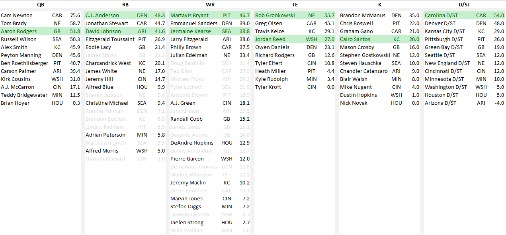

# Getting Started

This project sets out to determine the optimal fantasy lineup after the completion of the nfl playoffs. The rules for
the league are as follows:

- Standard PPR scoring
- Roster Consists of QB, RB, RB, WR, WR, (RB|WR|TE), TE, K, DT
- You can only pick one player per NFL team
- Choose wisely, because as soon as your player is knocked out of the playoffs you stop earning points (obviously!).
- End of playoff stats are available
  here: https://github.com/followsclosely/fantasy-sports/tree/master/nfl/playoff/src/main/resources/stats

The optimal lineup for the 2015 season is highlighted in green. The greyed out players are eliminated as there is a
higher scoring player from the same team at that position.


## The RosterGenerator Interface

Currently, there are three implementations
of [RosterGenerator](https://github.com/followsclosely/fantasy-sports/blob/master/nfl/playoff/src/main/java/io/github/followsclosley/fantasy/nfl/playoff/RosterGenerator.java)
. The optimal lineup according to each implementation can be seen below.

| Class Name                                                                                                                                                                                                | Points |          QB1          |         RB1          |         RB2          |          WR1           |          WR2           |      RB/WR/TE       |          TE1          |          K          |           DT            |
|:----------------------------------------------------------------------------------------------------------------------------------------------------------------------------------------------------------|:------:|:---------------------:|:--------------------:|:--------------------:|:----------------------:|:----------------------:|:-------------------:|:---------------------:|:-------------------:|:-----------------------:|
| [BruteForceLineupGenerator](https://github.com/followsclosely/fantasy-sports/blob/master/nfl/playoff/src/main/java/io/github/followsclosley/fantasy/nfl/playoff/generator/BruteForceLineupGenerator.java) | 383.94 | Aaron Rodgers (51.84) | C.J. Anderson (48.3) | David Johnson (41.6) | Martavis Bryant (46.7) | Jermaine Kearse (38.8) | Jordan Reed (27.0) | Rob Gronkowski (55.7) | Cairo Santos (20.0) |  Carolina D/ST (54.0)   |
| [MaxPointsLineupGenerator](https://github.com/followsclosely/fantasy-sports/blob/master/nfl/playoff/src/main/java/io/github/followsclosley/fantasy/nfl/playoff/generator/MaxPointsLineupGenerator.java)   | 362.80 | Cam Newton     (75.6) | C.J. Anderson (48.3) | David Johnson (41.6) | Martavis Bryant (46.7) | Jermaine Kearse (38.8) | Travis Kelce (29.1) | Rob Gronkowski (55.7) |  Blair Walsh (8.0)  |  Green Bay D/ST (19.0)  |
| [ValueLineupGenerator](https://github.com/followsclosely/fantasy-sports/blob/master/nfl/playoff/src/main/java/io/github/followsclosley/fantasy/nfl/playoff/generator/ValueLineupGenerator.java)           | 378.70 | Cam Newton     (75.6) | David Johnson (41.6) | C.J. Anderson (48.3) | Martavis Bryant (46.7) | Jermaine Kearse (38.8) | Jordan Reed (27.0)  | Rob Gronkowski (55.7) | Mason Crosby (16.0) | Kansas City D/ST (29.0) |

```bash
(16161ms) io.github.followsclosley.fantasy.nfl.playoff.generator.BruteForceLineupGenerator
Points: 383.94	Rob Gronkowski (55.7)	Carolina D/ST (54.0)	Aaron Rodgers (51.84)	C.J. Anderson (48.3)	Martavis Bryant (46.7)	David Johnson (41.6)	Jermaine Kearse (38.8)	Jordan Reed (27.0)	Cairo Santos (20.0)	

(0ms) io.github.followsclosley.fantasy.nfl.playoff.generator.MaxPointsLineupGenerator
Points: 362.80	Cam Newton     (75.6)	Rob Gronkowski (55.7)	C.J. Anderson (48.3)	Martavis Bryant (46.7)	David Johnson (41.6)	Jermaine Kearse (38.8)	Travis Kelce (29.1)	Green Bay D/ST (19.0)	Blair Walsh (8.0)	

(0ms) io.github.followsclosley.fantasy.nfl.playoff.generator.ValueLineupGenerator
Points: 378.70	Cam Newton     (75.6)	Rob Gronkowski (55.7)	C.J. Anderson (48.3)	Martavis Bryant (46.7)	David Johnson (41.6)	Jermaine Kearse (38.8)	Kansas City D/ST (29.0)	Jordan Reed (27.0)	Mason Crosby (16.0)	

```

## Reference Documentation

For further reference, please consider the following sections:

* [Official Gradle documentation](https://docs.gradle.org)
* [Spring Boot Gradle Plugin Reference Guide](https://docs.spring.io/spring-boot/docs/2.6.2/gradle-plugin/reference/html/)
* [Create an OCI image](https://docs.spring.io/spring-boot/docs/2.6.2/gradle-plugin/reference/html/#build-image)

## Additional Links

These additional references should also help you:

* [Gradle Build Scans – insights for your project's build](https://scans.gradle.com#gradle)
